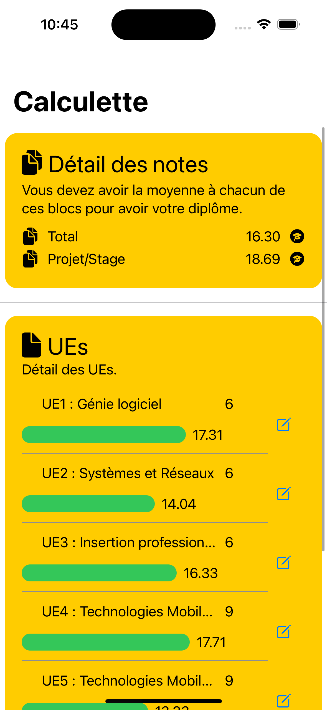
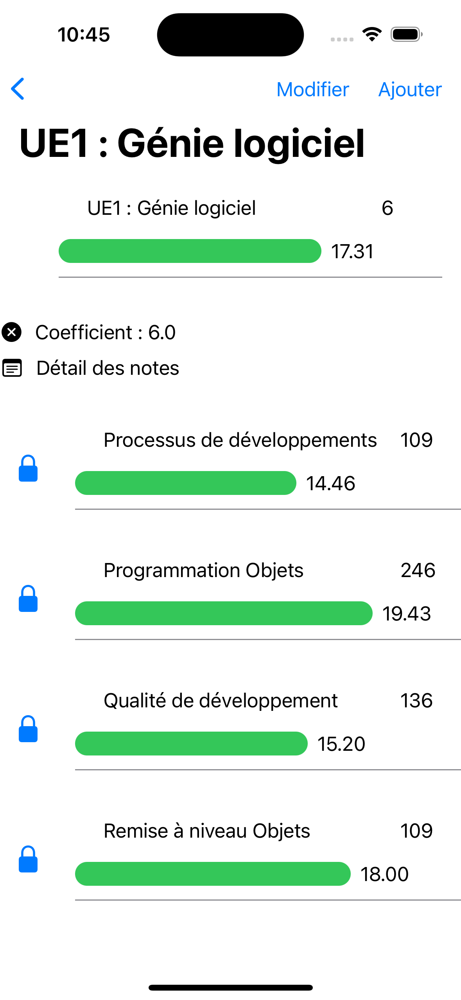
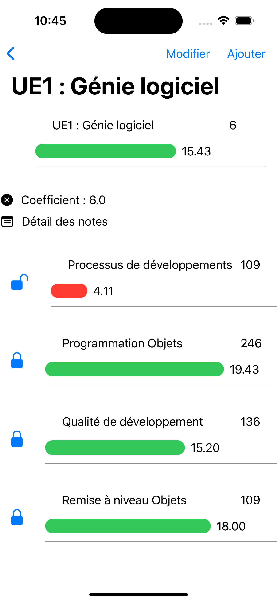
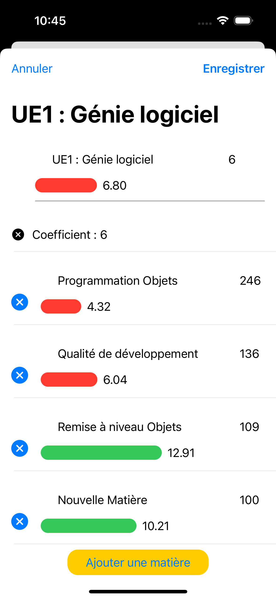
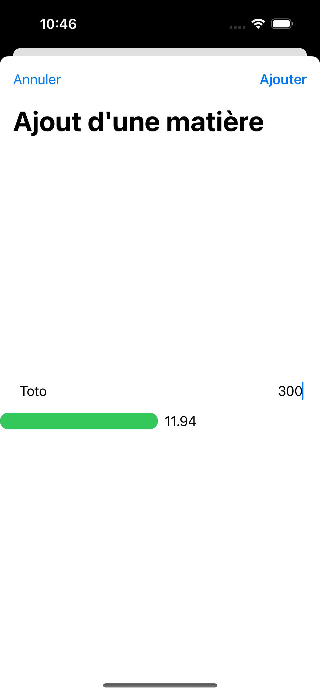

<h1 align="center">🏆 Odin 📝</h1>

The goal of Odin is to propose an iOS mobile application allowing the user to simulate average notes based on the subjects and teaching units.

## ✔️ Features

- [x] Browse teaching units, blocs, subjects and see data.
- [x] Unlock a subject to edit and simulate your average.
- [x] Edit your teaching units: change their name, coefficients, add and remove subjects.
- [x] Edit your subjects: change their name, coefficient, average and more!
- [x] There is a saving mecanism allowing you to use the app continously during your studies!

## 📱 Application

Here you can see the actual visual of the application 

    
    
    

    
    

    <i>
        As you can see, the visuals are really consistent with those of the original application, both in blur effects, in shapes, colors and layout.
    </i>

## 🖥️ Langages and technologies used

- Swift ([API reference](https://www.swift.org/))
- SwiftUI ([API reference](https://developer.apple.com/documentation/swiftui))

## 🧵 Prerequisities

- [XCode](https://apps.apple.com/fr/app/xcode/id497799835?mt=12)

## ⚙️ How to run the app ?

1. Start XCode.
2. Open the workspace named `Odin.xcworkspace` in `Sources/`.
3. Start an emulator or open the preview (`command` + `option` + `Enter`) for a file (example: `Odin/Views/CalculcatorView`) to browse the app.

## 📌 Documentation

The [Wiki](https://codefirst.iut.uca.fr/git/jeremy.tremblay/SwiftCast/wiki) is actually empty. The documantion will be added soon!

Also, look at the `Documentation` folder at the root of this repository!

## 👤 Author

**TREMBLAY Jérémy**

* Github: [@JeremyTremblay2](https://github.com/JeremyTremblay2)
* LinkedIn: [@Jérémy Tremlay](https://fr.linkedin.com/in/j%C3%A9r%C3%A9my-tremblay2)

## 📝 License

I want to leave the possibility to other people to work on this project, to improve it and to make it grow, that's why we decided to place it under MIT license.

> Read more about the [MIT licence](https://opensource.org/licenses/MIT).